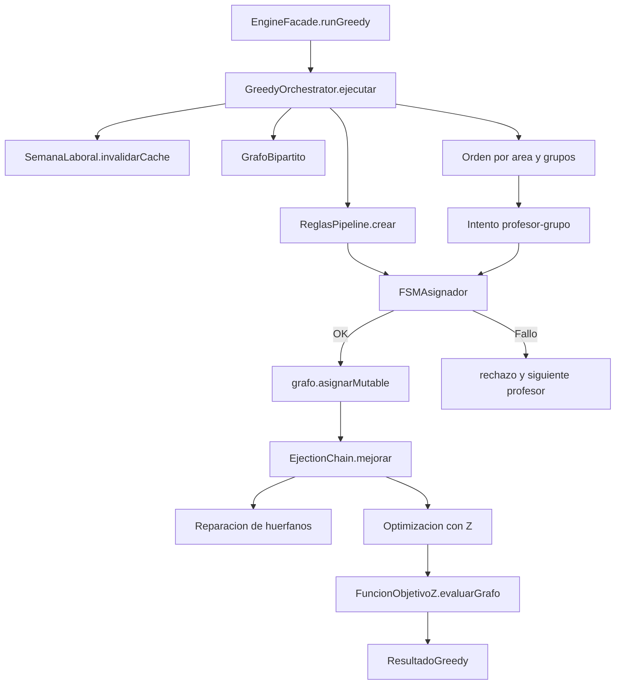
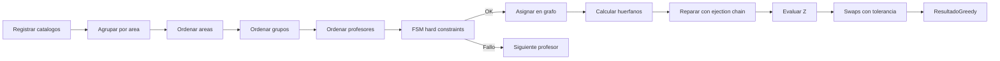
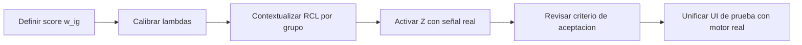

# Contexto actual del GRASP de timetabling

## Resumen ejecutivo

El solver actual de `frontend-react/solution` trabaja sobre un `GrafoBipartito` de profesores y grupos. Cada intento de asignacion pasa por un `FSMAsignador` con restricciones duras, despues se ejecuta una fase de reparacion de huerfanos con `EjectionChain` y al final una fase de optimizacion local sobre la funcion `Z`.

En la practica, la configuracion por defecto no esta explotando todavia todo el potencial de un GRASP probabilistico, pero esto debe leerse como una decision temporal y no como un error de implementacion. Segun tu aclaracion, la capa RCL/metaheuristica todavia no corre de forma plena porque faltan los pesos de `soft constraints`; por eso existe intencionalmente una funcion mockup/provisional mientras se define esa calibracion.

## Mapa de componentes

| Componente | Ruta | Rol actual |
| --- | --- | --- |
| `EngineFacade` | `frontend-react/solution/EngineFacade.ts` | Punto de entrada para construir grafo, correr FSM paso a paso y lanzar el greedy. |
| `GrafoBipartito` | `frontend-react/solution/models/GrafoBipartito.ts` | Estado central: profesores, grupos, adyacencias y asignaciones inversas. |
| `FSMAsignador` | `frontend-react/solution/fsm/FSMAsignador.ts` | Ejecuta el pipeline de restricciones duras y produce un grafo nuevo si la asignacion es valida. |
| `GraphFSMAsignador` | `frontend-react/solution/fsm/GraphFSMAsignador.ts` | Variante de depuracion que genera snapshots paso a paso. |
| `ReglasPipeline` | `frontend-react/solution/rules/ReglasPipeline.ts` | Define el orden real de las restricciones duras. |
| `SemanaLaboral` | `frontend-react/solution/models/SemanaLaboral.ts` | Cache por profesor y fusion de bloques laborales para validar disponibilidad. |
| `GreedyOrchestrator` | `frontend-react/solution/greedy/GreedyOrchestrator.ts` | Orquesta la fase constructiva, la reparacion y la salida de metricas. |
| `EjectionChain` | `frontend-react/solution/greedy/EjectionChain.ts` | Repara huerfanos y luego intenta swaps para mejorar `Z`. |
| `FuncionObjetivoZ` | `frontend-react/solution/objective/FuncionObjetivoZ.ts` | Calcula recompensa, penalizacion total y valor final `Z`. |
| `SoftConstraints` | `frontend-react/solution/objective/SoftConstraints.ts` | Penaliza huecos y bloques consecutivos. |
| `IModeloML` | `frontend-react/solution/ml/IModeloML.ts` | Interfaz de score `w_ig`; hoy usa un stub uniforme por defecto. |

## Diagrama de arquitectura



## Flujo real de ejecucion

| Fase | Implementacion principal | Que hace hoy |
| --- | --- | --- |
| Entrada | `GreedyOrchestrator.ejecutar()` | Invalida cache, crea grafo, registra catalogos, construye FSM y agrupa por area. |
| Constructiva | `GreedyOrchestrator.ejecutar()` | Recorre `area -> grupo -> profesor`, usa FSM y asigna en cuanto encuentra un profesor valido. |
| Reparacion | `EjectionChain._repararHuerfanos()` | Intenta cadenas de eyeccion dentro de la misma area; si no puede, prueba asignacion directa. |
| Optimizacion | `EjectionChain._optimizarZ()` | Prueba swaps aleatorios y solo acepta mejoras significativas en `Z`. |
| Salida | `GreedyOrchestrator.ejecutar()` | Extrae `AsignacionInput[]` y construye `MetricasGreedy`. |

## Pipeline de restricciones duras

El orden real del pipeline esta definido en `ReglasPipeline.crear()`:

| Orden | Regla | Efecto |
| --- | --- | --- |
| 1 | `REGLA_GRUPO_TIENE_PROGRAMACION` | Rechaza grupos sin horarios cargados. |
| 2 | `REGLA_AREA` | Obliga coincidencia exacta de `idArea` entre profesor y grupo. |
| 3 | `REGLA_HORARIO_LABORAL` | Verifica cobertura completa del horario del grupo dentro del horario laboral fusionado del profesor. |
| 4 | `REGLA_TRASLAPE_UEA` | Evita choques con grupos ya asignados al mismo profesor. |
| 5 | `REGLA_MAXIMO_N_HORAS_LABORALES` | Impide rebasar el limite semanal. |

## Diagrama del pipeline



## Funcion objetivo y su efecto actual

La formula implementada en `FuncionObjetivoZ` es:

```text
Z = recompensa - penalizacionTotal
recompensa = sum(score(numEco, idGrupo))
penalizacionTotal = sum(lambda_k * f_k(X))
```

Constraints activas por defecto:

| Constraint | Lambda | Idea |
| --- | --- | --- |
| `PenalizacionHuecos` | `2.0` | Penaliza huecos entre clases de un mismo profesor. |
| `PenalizacionCargaConsecutiva` | `1.5` | Penaliza bloques consecutivos que exceden el umbral. |

Punto importante del estado actual:

- `ModeloMLUniforme` retorna `1.0` para cualquier par profesor-grupo.
- Ambas soft constraints multiplican por `(1 - wPromedio)`.
- Si `wPromedio = 1`, la penalizacion se vuelve `0`.
- Resultado practico: con la configuracion por defecto, `Z` se parece mucho al numero de asignaciones y los swaps de la fase de optimizacion casi nunca mejoran nada.
- Interpretacion correcta: esto hoy funciona como una etapa provisional intencional mientras no existan pesos utiles para gobernar la metaheuristica.

## Como se comporta hoy en la practica

1. El camino "normal" del motor entra por `GreedyOrchestrator` con `EstrategiaMCV`, no con `EstrategiaRCL`.
2. La heuristica MCV ordena areas con menos grupos primero y grupos con mas franjas primero, pero no hace ordenamiento especial de profesores.
3. La heuristica RCL existe, pero `ordenarProfesores()` usa `score(p.numeroEconomico, 0)`, es decir, no usa el grupo candidato real.
4. Con el modelo uniforme actual, la RCL no discrimina por calidad; en la practica termina barajando toda la lista elegible.
5. Eso no implica necesariamente una falla conceptual: hoy se preserva una capa mockup/provisional porque aun no hay pesos de `soft constraints` que hagan significativa la parte metaheuristica.
6. La fase de reparacion si aporta valor real hoy, porque puede aumentar el numero de grupos asignados aunque la optimizacion local no cambie `Z`.
7. `EngineFacade.buildGrafoForArea()` consulta `getCandidatosPorArea(areaId)`, pero para el grafo solo consume `profesores` y `grupos`; las tripletas candidatas quedan mas asociadas a UI de depuracion que al solver central.

## Diferencia entre motor real y UI de prueba

| Pieza | Que hace | Relacion con el solver real |
| --- | --- | --- |
| `GRASPTestModal.tsx` | Simula un flujo visual con candidatos, pausa/continua y muestra un panel de debug. | Es una UI diagnostica; no ejecuta la misma logica de `FuncionObjetivoZ` ni de `EjectionChain`, y debe entenderse como soporte provisional. |
| `calcularPenalizacionSoft()` en `GRASPTestModal.tsx` | Usa `Z = w_ij - lambda * P_soft` con `P_soft` basado en horas ocupadas. | Es una formula mockup intencional, separada del modelo de produccion mientras no existan pesos calibrados para `soft constraints`. |
| `FSMVisualizerModal.tsx` | Reproduce snapshots del FSM paso a paso. | Si reutiliza `GraphFSMAsignador`, por lo que es mas fiel al pipeline hard. |
| `TestFSMHookModal.tsx` | Modal para iniciar datos y disparar un intento individual. | Es claramente una herramienta de prueba; el propio texto habla de `Profesor Mock` y `Grupo Mock`. |

## Evidencia en pruebas

| Archivo de prueba | Que deja claro |
| --- | --- |
| `frontend-react/solution/__tests__/entrada.test.ts` | El cache de `SemanaLaboral` y las operaciones base del grafo son parte del comportamiento esperado. |
| `frontend-react/solution/__tests__/constructiva.test.ts` | El FSM rechaza por colision, area, horario, traslape y exceso de horas; tambien valida la forma actual de `EstrategiaRCL`. |
| `frontend-react/solution/__tests__/reparacion.test.ts` | La reparacion debe preservar rollback cuando no hay solucion y aumentar o preservar asignaciones cuando si la hay. |
| `frontend-react/solution/__tests__/optimizacion.test.ts` | La aceptacion de cambios depende completamente de `CriterioAceptacion.clasificarDelta()`. |
| `frontend-react/solution/__tests__/resultado.test.ts` | La salida del orquestador debe ser coherente y completa aun cuando la optimizacion este desactivada. |

## Apendice: mockups, stubs y TODOs detectados

Busqueda literal de `TODO`, `FIXME` y `XXX` en `frontend-react/solution`:

```text
Sin coincidencias literales.
```

Hallazgos equivalentes al final de la implementacion actual:

| Tipo | Ubicacion | Evidencia | Impacto |
| --- | --- | --- | --- |
| Stub funcional | `frontend-react/solution/ml/IModeloML.ts:11-17` | El comentario indica que `XGBoost` aun no esta integrado y `ModeloMLUniforme` retorna `1.0`. | Mantiene el motor en una etapa provisional mientras no haya pesos utiles para `soft constraints`. |
| Pendiente explicito | `frontend-react/solution/greedy/EstrategiaMCV.ts:37-38` | Comentario: "Por ahora, sin ordenamiento especial de profesores" y "futuras iteraciones". | El orden de profesores queda plano en la estrategia por defecto. |
| Heuristica incompleta | `frontend-react/solution/greedy/EstrategiaRCL.ts:57` | El score se calcula con `score(p.numeroEconomico, 0)`. | La RCL no depende del grupo candidato real; hoy sigue en modo preparatorio para cuando existan pesos y score contextual. |
| Mockup de prueba | `frontend-react/solution/components/TestFSMHookModal.tsx:58` | El texto del modal habla de "Profesor Mock" y "Grupo Mock". | Es una pieza de soporte para pruebas, no un flujo final de operacion. |
| UI provisional | `frontend-react/solution/components/GRASPTestModal.tsx:408` | Muestra un badge `PROVISIONAL`. | Indica claramente que la interfaz es diagnostica y no definitiva. |
| Formula provisional | `frontend-react/solution/components/GRASPTestModal.tsx:158-179` y `:529-530` | Usa `calcularPenalizacionSoft()` y una formula local `Z = w_ij - lambda * P_soft`. | No coincide con `FuncionObjetivoZ`; sirve como mockup intencional mientras no se definan pesos de `soft constraints`. |

## Que falta para activar la metaheuristica completa

Para que el solver deje de operar en modo provisional y pase a un GRASP realmente guiado por RCL + metaheuristica, faltan al menos estas piezas:

| Frente | Estado actual | Cambio necesario |
| --- | --- | --- |
| Score `w_ig` | `ModeloMLUniforme` siempre devuelve `1.0`. | Sustituirlo por un score contextual profesor-grupo, aunque inicialmente sea heuristico y no ML. |
| Pesos de soft constraints | Existen constraints y lambdas por defecto, pero no estan calibrados contra una escala util de score. | Definir y validar pesos comparables entre recompensa y penalizacion. |
| RCL contextual | `EstrategiaRCL` usa `score(p.numeroEconomico, 0)`. | Hacer que la RCL reciba el grupo candidato real y ordene contra `score(p, grupo)`. |
| Optimizacion local | Los swaps rara vez cambian `Z` con score uniforme. | Recalcular `Z` con pesos reales para que aceptar/rechazar swaps tenga señal util. |
| UI de prueba | `GRASPTestModal` usa una formula local provisional. | Alinear la UI de diagnostico con `FuncionObjetivoZ` una vez definidos los pesos. |

### Cambios tecnicos concretos

1. Reemplazar `ModeloMLUniforme` por una fuente de score real.
   Puede ser un modelo ML, una heuristica parametrica, o una tabla de compatibilidad mientras se llega al modelo final.

2. Hacer contextual la API de la RCL.
   Hoy `ordenarProfesores(profesores)` no recibe el grupo.
   Para una RCL real, la estrategia necesita al menos `profesor + grupo candidato + estado parcial`.

3. Fijar una escala comun entre recompensa y penalizacion.
   Si `w_ig` vive en `[0,1]`, entonces las penalizaciones y lambdas deben calibrarse para competir en esa misma magnitud.

4. Decidir que soft constraints van a gobernar la exploracion.
   Las dos ya implementadas son una buena base:
   `PenalizacionHuecos`
   `PenalizacionCargaConsecutiva`

5. Convertir la formula provisional de UI en una vista del motor real.
   La UI de prueba no deberia inventar `Z`; deberia consultar el mismo calculo usado por `FuncionObjetivoZ`.

6. Recalibrar el criterio de aceptacion.
   Cuando existan pesos reales, habra que revisar `epsAbs`, `epsRel` y `alfa` en `CriterioAceptacion` para que ni sobreacepte ruido ni bloquee mejoras pequenas pero utiles.

### Orden recomendado de implementacion



### Criterio practico para considerar la metaheuristica “activada”

- La RCL ya no usa `grupoId = 0`, sino el grupo candidato real.
- `Z` cambia de forma no trivial ante swaps entre profesores factibles.
- Las soft constraints generan penalizaciones distintas de cero en escenarios reales.
- La UI de prueba muestra el mismo `Z` que calcula el motor.
- Las pruebas cubren mejora real de `Z`, no solo consistencia estructural.

## Conclusion corta

Hoy el solver esta bien estructurado en capas y ya tiene una fase constructiva valida, un FSM reutilizable y una reparacion con rollback razonable. Lo que todavia no esta plenamente activado es la parte "inteligente" del GRASP, pero ahora el documento deja claro que eso responde a una decision temporal: mientras no existan pesos de `soft constraints`, la funcion mockup/provisional sostiene la exploracion del flujo sin fijar todavia la metaheuristica definitiva.
