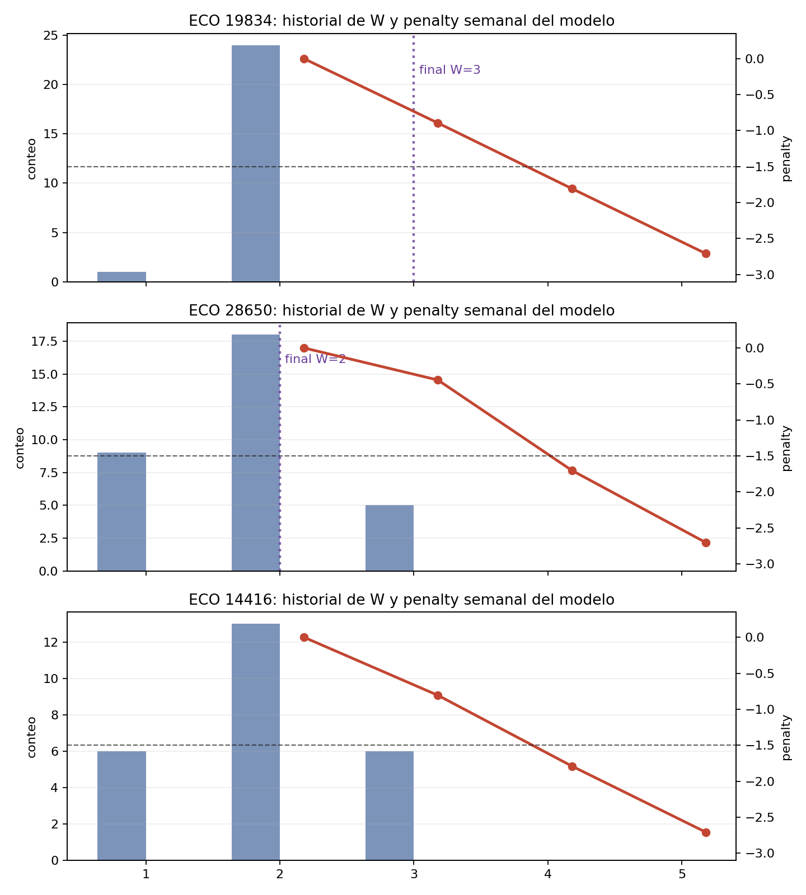
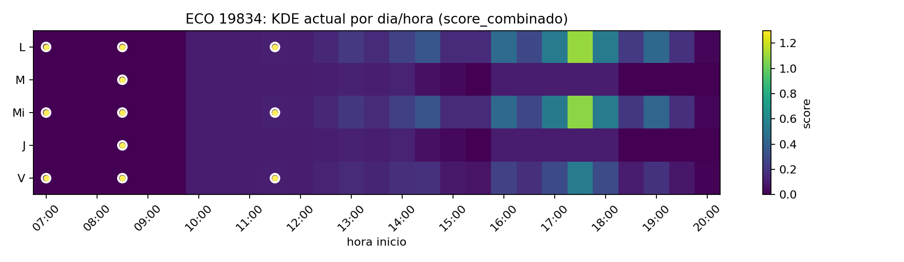
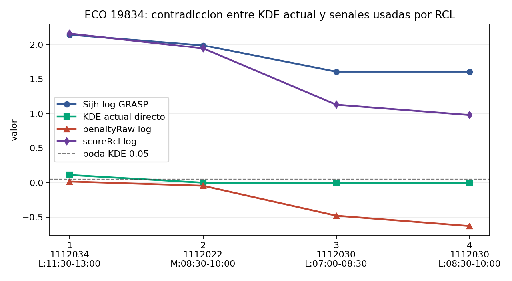
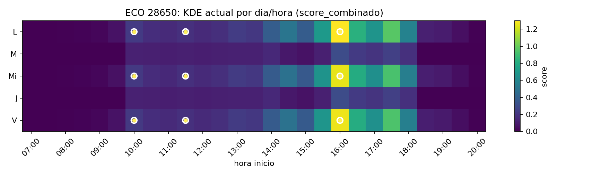
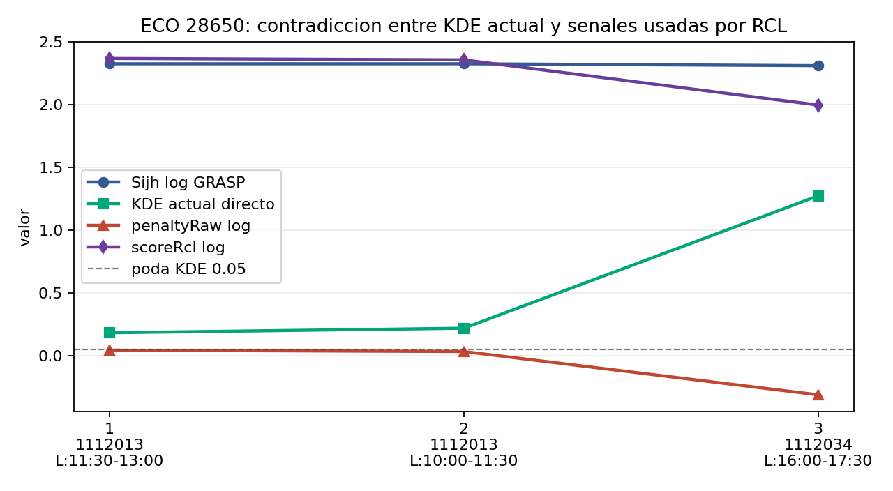

# Diagnostico de carga improbable en GRASP 26p

Fecha: 2026-05-26

Este diagnostico cruza tres fuentes: las reglas de los skills de machine learning leidos en `.agents`, la estructura del GRASP/frontend en `PT/frontend-react/solution`, y los modelos/servicios en `ServidorPython`. El foco fue explicar por contradiccion por que aparecen profesores con cargas u horarios de muy baja probabilidad sin hardcodear ECOs como `19834`, `28650` o `14416`.

## Tesis corta

La causa mas probable no es que el KDE del backend "crea" que la maniana de `19834` es buena. Al contrario: el KDE actual devuelve casi cero para esas asignaciones. La contradiccion aparece porque el GRASP parece estar consumiendo un `Sijh` cacheado, incompleto o viejo, donde `h_ih` no corresponde al horario actual.

La segunda causa es de escala: la penalizacion de carga permite `W=3` para `19834` porque el umbral de bloqueo esta en `-1.5` y la curva actual da `W=3 = -0.895`, aunque historicamente el profesor tenga 24/25 trimestres con `W=2` y cero trimestres con `W=3` o `W=4`.

La tercera causa es que el top 5 historico se calcula y se cachea, pero no esta actuando como mascara ni como barrera real dentro del GRASP.

## Prueba por contradiccion

### Contradiccion A: si el GRASP usara el KDE vigente, no aceptaria esos horarios de `19834`

Hipotesis negada: el GRASP esta rankeando con el mismo KDE que expone el backend actual.

Evidencia para `19834`:

| Asignacion final | KDE directo actual | `Sijh` logueado por GRASP | Resultado |
| --- | ---: | ---: | --- |
| `M:08:30-10:00|J:08:30-10:00` | `0.000000` | `1.990468` | Aceptado |
| `L:07:00-08:30|Mi:07:00-08:30|V:07:00-08:30` | `0.000000` | `1.608235` | Aceptado |
| `L:08:30-10:00|Mi:08:30-10:00|V:08:30-10:00` | `0.000000` | `1.608235` | Aceptado |
| `L:11:30-13:00|Mi:11:30-13:00|V:11:30-13:00` | `0.111906` | `2.145770` | Aceptado |

La contradiccion es fuerte: una senal que debe podar con `h_ih < 0.05` no puede simultaneamente ser cero en el backend vigente y superar la poda dentro del GRASP, salvo que el GRASP no este usando esa senal vigente.

La estructura lo explica:

- `ServidorPython/app/main.py:180-190` define `/soft_constraints/r_hat/single` y solo devuelve `{ rhat }`.
- `ServidorPython/app/main.py:429-459` define `/S_ijh`, que si recibe `horario` y devuelve `{ rhat, h_ih }`.
- `PT/frontend-react/solution/ml/SijhCacheManager.ts:126` arma keys por `eco`, `uea` y `horario`.
- `PT/frontend-react/solution/ml/SijhCacheManager.ts:188-191` y `:324-326` llaman a `/soft_constraints/r_hat/single` sin mandar `horario`.
- `PT/frontend-react/solution/ml/SijhCacheManager.ts:194` espera `resData.h_ih`, pero ese endpoint no lo entrega.

Eso deja dos estados peligrosos: si Redis ya tiene `Sijh_*`, se usan valores viejos; si Redis no los tiene, el warm-up no puede poblar correctamente `h_ih`. Ambos estados rompen la semantica esperada de `Sijh_eco_uea_horario`.

### Contradiccion B: si el penalty de carga modelara la cola individual, `W=3` en `19834` deberia ser casi imposible

Hipotesis negada: la curva de carga ya convierte la ausencia historica de `W>2` en una barrera suficiente.

Evidencia:

| ECO | Historial de W | Pico | W final | Curva `loads` |
| --- | --- | ---: | ---: | --- |
| `19834` | `W=2`: 24, `W=1`: 1, `W>=3`: 0 | 2 | 3 | `W2=-0.000`, `W3=-0.895`, `W4=-1.806`, `W5=-2.709` |
| `28650` | `W=2`: 18, `W=1`: 9, `W=3`: 5 | 2 | 2 | `W2=-0.000`, `W3=-0.446`, `W4=-1.702`, `W5=-2.704` |
| `14416` | `W=2`: 13, `W=1`: 6, `W=3`: 6 | 2 | 0 | `W2=-0.000`, `W3=-0.807`, `W4=-1.790`, `W5=-2.709` |

En `PT/frontend-react/solution/objective/ViabilidadPenalizacionCarga.ts:59`, el bloqueo de dominio usa `-1.5` por defecto. En `:204-209`, se bloquea solo si `totalPenalty <= -1.5` o `loadPenalty <= -1.5`.

Para `19834`, `W=3` queda en `-0.895`, asi que no se bloquea. `W=4` si cruzaria el umbral. Ese comportamiento contradice la semantica deseada: si el pico es `W=2`, hay 25 trimestres observados, y no existe `W=3`, entonces `W=3` no deberia quedar en zona "moderadamente aceptable".

### Contradiccion C: si el top 5 fuera una mascara, las manianas de `19834` no competirian contra tarde

Hipotesis negada: el top 5 historico participa directamente como restriccion o soporte fuerte en GRASP.

Para `19834`, los horarios historicos mas frecuentes son:

| Rank | Patron historico | Frecuencia |
| ---: | --- | ---: |
| 1 | `L:17:30-19:00|Mi:17:30-19:00|V:17:30-19:00` | 14 |
| 2 | `L:16:00-17:30|Mi:16:00-17:30|V:16:00-17:30` | 9 |
| 3 | `L:19:00-20:30|Mi:19:00-20:30|V:19:00-20:30` | 4 |
| 4 | `L:17:30-19:00` | 3 |
| 5 | `L:14:30-16:00|Mi:14:30-16:00|V:14:30-16:00` | 3 |

Pero las asignaciones finales aceptadas caen en `07:00`, `08:30` y `11:30`. En frontend, `best_5` se conserva en cache (`PT/frontend-react/solution/ml/ModeloPenaltyCached.ts:8`, `:64`, `:129-130`) y en respuestas observadas (`PT/frontend-react/solution/ml/PenaltyObservedCache.ts:587-589`), pero no aparece consumido por `GreedyOrchestrator` como mascara ni como termino explicito de `scoreRcl`.

## Graficas generadas

### Curvas de carga vigiladas



Lectura visual: `19834` concentra historicamente `W=2` y aun asi termina en `W=3`. La barra roja de `W=3` queda por encima del umbral de bloqueo `-1.5`, por eso el GRASP la considera viable. En `28650`, `W=3` existe historicamente y el resultado final queda en `W=2`, por lo que el problema ahi es menos de carga y mas de ranking horario.

### Superficie KDE de `19834`



Lectura visual: la masa del KDE esta en tarde, sobre todo `L/Mi/V` alrededor de `16:00-19:00`. Las marcas de asignacion final aparecen sobre zonas oscuras o casi oscuras: `07:00`, `08:30` y `11:30`. La grafica confirma que el backend KDE no apoya esas asignaciones.

### RCL contra KDE directo para `19834`



Lectura visual: la linea verde, KDE directo, cae a cero o casi cero; la linea azul, `Sijh` logueado, sigue alta. El penalty resta algo, pero no lo suficiente para sacar al candidato del top-k/RCL.

### Superficie KDE de `28650`



Lectura visual: existe soporte real en tarde y algo de soporte en maniana media. La asignacion de `16:00` esta alineada con el historial, mientras que las de `10:00` y `11:30` son mas debiles.

### RCL contra KDE directo para `28650`



Lectura visual: el `Sijh` logueado se ve casi plano alrededor de `2.32`, aunque el KDE directo distingue claramente el horario de `16:00`. Esto refuerza que la senal KDE no esta modulando suficientemente la seleccion.

## Hipotesis estructurales

### H1 - Cache `Sijh` usa endpoint equivocado y deja `h_ih` inconsistente

Se arma una key por horario, pero se consulta un endpoint que no recibe horario. El endpoint correcto para la semantica `Sijh(eco, uea, horario)` es `/S_ijh`.

Impacto esperado: horarios con KDE actual casi cero pueden quedar con `h_ih` alto si Redis contiene entradas viejas. Tambien puede pasar lo inverso: profesores con soporte real pueden ser rechazados por `PODA_KDE` si la entrada falta o esta en cero.

### H2 - El RCL es aditivo y permite que RHat rescate horarios fuera de soporte

En `PT/frontend-react/solution/greedy/GreedyOrchestrator.ts:415`, la poda depende de `detalles.h_ih < 0.05`. En `:696`, el ranking usa:

```ts
cand.scoreRcl = cand.scoreSijh + (this._lambdaPenaltyRcl * penalty.viabilidad);
```

Si `scoreSijh` viene alto por cache/RHat, una penalizacion moderada no basta para sacar al candidato. Para `19834`, los casos con KDE directo cero aun conservaron `scoreRcl` positivos y competitivos.

### H3 - La barrera de carga empieza demasiado tarde

El umbral `-1.5` bloquea `W=4` en `19834`, pero no `W=3`. Para profesores concentrados, el primer paso fuera del pico puede ser el mas importante. En este caso, `W=3` no es una leve extrapolacion: es una carga nunca observada en 25 trimestres crudos.

### H4 - Los estadisticos/Z-score del penalty no estan actuando

`PT/frontend-react/solution/objective/ViabilidadPenalizacionCarga.ts:182-184` normaliza devolviendo el penalty igual:

```ts
private _normalizarConEstadisticos(penalty: number): number {
    return penalty;
}
```

Entonces los estadisticos calculados en `ModeloPenaltyCached` no calibran la escala que compite contra `Sijh`. Esto deja una suma de unidades heterogeneas: `Sijh` puede moverse en rangos de 1.5 a 2.3, mientras la carga de `W=3` para `19834` solo resta alrededor de 0.9.

### H5 - El fine tuning no fuerza bien las colas individuales

El split 80/20 por si solo no corrige el caso `19834` porque el conjunto de test no contiene `W>2` para ese profesor. Ademas:

- `ServidorPython/volumen/archivos/retrain_finetuned_v3.py:80` calcula `w_test = len(records)`, que puede contar filas/grupos y no necesariamente UEAs unicas.
- `ServidorPython/volumen/archivos/retrain_finetuned_v3.py:215-223` contrasta `W_test` contra `W_test+1` y `W_test+2`, pero con margenes fijos.
- `ServidorPython/volumen/archivos/retrain_finetuned_v3.py:271` submuestrea a 50 muestras, lo que puede diluir profesores raros.
- `ServidorPython/volumen/archivos/penalizacion_carga/finetuning/scenarios.py:92` muestrea `W` uniforme entre min y max, no desde la distribucion empirica.
- `ServidorPython/volumen/archivos/penalizacion_carga/finetuning/scenarios.py:120-123` solo extrapola `W+1`.
- `ServidorPython/volumen/archivos/penalizacion_carga/finetuning/loss.py:170-183` normaliza por min-max dentro de cada ECO, perdiendo escala absoluta.
- `ServidorPython/volumen/archivos/penalizacion_carga/configs/default_finetuning.yaml:55` deja `w_penalty_scale` en `0.00`.

La consecuencia es que el entrenamiento puede ordenar colas, pero no aprende necesariamente que algunas colas deben volverse casi prohibidas.

### H6 - El top 5 explica patrones, pero no gobierna la busqueda

El top 5 se usa en reportes, cache y escenarios de fine tuning. No se observa como filtro o termino explicito de `scoreRcl`. Por eso, aunque los top 5 de `19834` esten en tarde, el GRASP puede elegir maniana si `Sijh` cacheado y penalty aditivo lo permiten.

## Segunda pasada visual

Despues de generar las graficas, hice una segunda lectura visual sobre las imagenes:

- La superficie de `19834` muestra asignaciones finales fuera de la masa KDE. Esto invalida la idea de que el KDE actual apoya la maniana.
- La grafica RCL vs KDE de `19834` muestra una divergencia casi perfecta: `Sijh` logueado alto contra KDE directo cero.
- La grafica de carga muestra que el sistema bloquea tarde: `W=4` seria rechazado, pero `W=3` pasa.
- En `28650`, el caso no contradice tanto la carga final, sino que revela que el `Sijh` plano no aprovecha la diferencia horaria detectada por KDE.
- `14416` es una alerta inversa: hay historial para `W=2` y `W=3`, pero puede terminar sin asignacion si la poda KDE queda alimentada por cache faltante/cero.

## Ajustes a explorar sin hardcode

1. Corregir primero la fuente de verdad de `Sijh`.

   `SijhCacheManager` debe poblar `Sijh_${eco}_${uea}_${horario}` desde `/S_ijh` con `{ eco, uea, horario }`, o combinar explicitamente RHat con el cache KDE por horario. Despues de cambiarlo, invalidar todas las keys `Sijh_*`.

2. Hacer que `PODA_KDE` lea KDE vigente y horario-especifico.

   La mascara no debe depender de un `h_ih` viejo dentro de `Sijh`. Si se desea evitar hard constraints, usar una compuerta suave pero muy inclinada:

   ```text
   kde_gate = sigmoid((log_density_ratio - tau) / temperature)
   score = rhat * kde_gate + lambda_penalty * viability
   ```

   Asi, KDE cercano a cero no se "rescata" con RHat alto, pero sigue siendo una regla aprendida/continua.

3. Cambiar la penalizacion de carga a una cola calibrada por profesor.

   Para cada ECO con historial suficiente, calcular confianza por `n_trimestres`, concentracion y ratio de densidad:

   ```text
   density_ratio(W) = kde_W(W) / kde_W(W_peak)
   tail_support(W) = P_hist(carga >= W)
   ```

   Si `W > W_peak`, `density_ratio` es casi cero y `tail_support` es cero, el penalty debe entrar en zona severa desde `W=3`, no esperar a `W=4`. Esto generaliza a los mas de 100 profesores sin enumerarlos.

4. Reactivar una escala comparable entre `Sijh` y penalty.

   La funcion `_normalizarConEstadisticos` no puede ser identidad si `scoreRcl` suma senales heterogeneas. Alternativas:

   - convertir penalty a z-score usando estadisticos reales del producto candidato;
   - convertir penalty a probabilidad/viabilidad calibrada;
   - o aprender `lambdaPenaltyRcl` con validacion de replay.

5. Ajustar fine tuning para colas ausentes.

   Generar escenarios por ECO para `W_peak+1`, `W_peak+2` y `frontier+1`, pesados por concentracion historica. En `19834`, `W=3` debe recibir mucho peso porque `W=2` concentra casi todo el historial. Usar UEAs unicas por trimestre y evitar que el submuestreo de 50 borre casos de alta confianza.

6. Usar top 5 como soporte, no como lista hardcodeada.

   El top 5 puede aportar un termino de soporte de patron:

   ```text
   support_score = KDE_horario * pattern_support_eco
   ```

   Para profesores con historial suficiente, patrones fuera del soporte local y global deben recibir una barrera suave. Para profesores con poco historial, bajar la confianza y permitir mayor exploracion.

7. Evaluar por contradicciones vigiladas y metrica global.

   La prueba minima posterior debe revisar:

   - Redis `Sijh_19834_*_M:08:30-10:00|J:08:30-10:00` coincide con `/S_ijh`.
   - Todo horario de `19834` con KDE directo `<0.05` queda fuera del RCL o con score practicamente no competitivo.
   - `W=3` para `19834` cae en zona severa por cola, sin regla especial para `19834`.
   - `28650` conserva viabilidad de `W=2` y prefiere tarde cuando KDE lo soporta.
   - `14416` no queda sobrepodado por entradas faltantes/cero.
   - En el conjunto completo, baja la tasa de asignaciones con `density_ratio` casi cero sin aumentar demasiado grupos sin cubrir.

## Prioridad recomendada

1. Arreglar cache/endpoint `Sijh` y limpiar Redis.
2. Repetir diagnostico de `19834`, `28650`, `14416` con las mismas graficas.
3. Ajustar escala de `scoreRcl` y penalty de carga.
4. Modificar fine tuning para colas individuales de alta confianza.
5. Incorporar top 5/KDE como soporte probabilistico de patron.

Mientras H1 siga abierta, cualquier fine tuning puede parecer fallar aunque el backend este calculando bien: el GRASP estaria tomando decisiones con una senal distinta a la evaluada.
