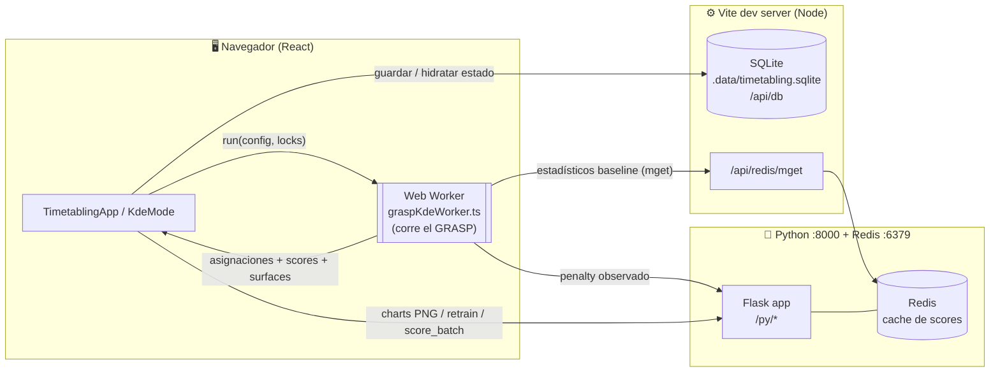
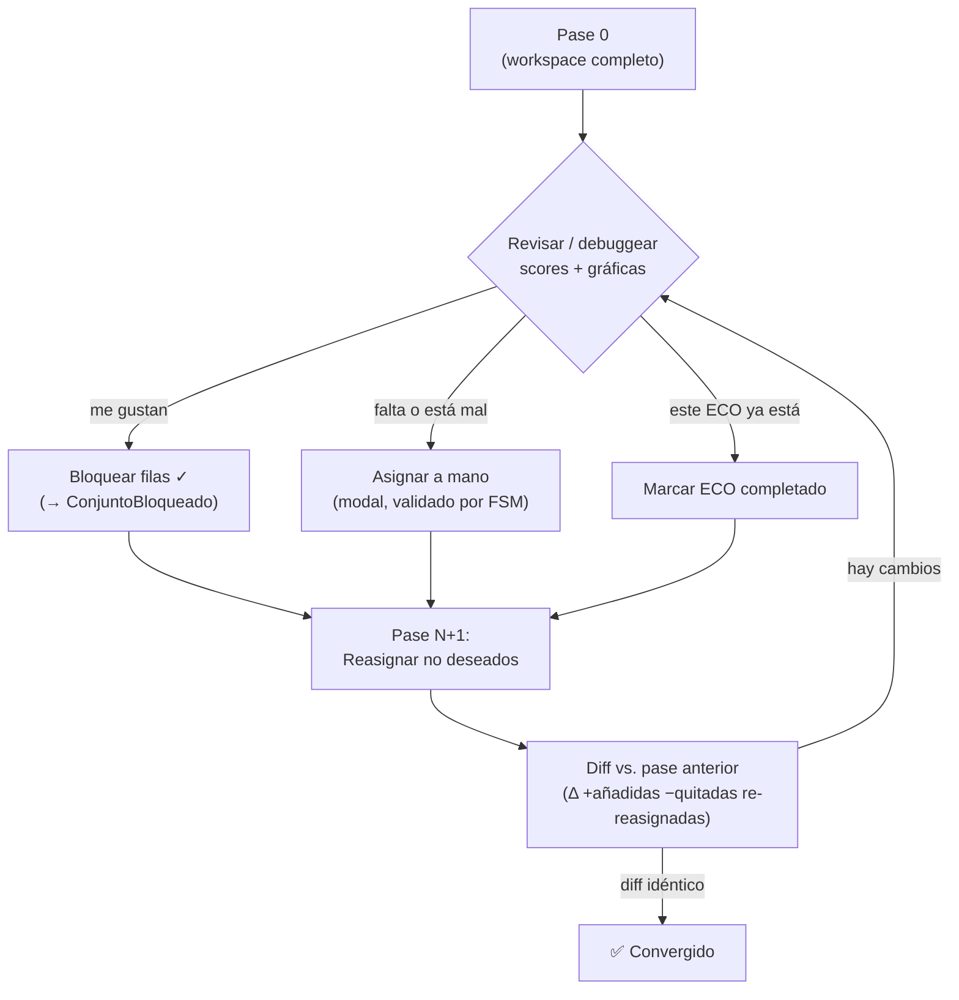

# Manual de UX — Frontend Timetabling (Modo KDE)

> **Para qué sirve este documento.** Es el manual de referencia del frontend `/timetabling`
> y un *brief* de diseño. Describe **qué hace cada pieza de la UI, cómo fluye el trabajo y de
> dónde sale/va cada dato**, con el fin de que un rediseño de UX pueda **agilizar la
> manipulación manual de la solución** del GRASP y **facilitar el debugging** (gráficas y
> scores), respetando que el proceso es **incremental** (pase a pase) y que la **persistencia
> y la fiabilidad** son requisitos de primera clase.
>
> Audiencia: diseño de UX/UI. No se requiere leer el código, pero todas las afirmaciones están
> ancladas a archivos concretos para poder verificarlas.

---

## 1. Propósito del frontend

El script `solution/greedy/testAsinacionKDE.ts` es un *runner* de línea de comandos que ejecuta
el **GRASP con función objetivo KDE** sobre la programación de un trimestre (26P), evalúa la
solución y vuelca artefactos a disco (`solucion_asignacion.json`, `summary.json`,
`kde_surface_points.json`, un Excel reconstruido, logs de fase 1 y de *ejection chain*).

**El frontend replica ese script dentro del navegador** y le añade lo que un script de consola
no puede dar: **interacción humana sobre la solución**. En lugar de correr el GRASP una sola vez
y aceptar el resultado, el usuario puede:

1. Correr el GRASP (un **pase**) con los mismos parámetros y la misma paridad que el script.
2. **Inspeccionar** cada asignación con sus scores y sus gráficas KDE (debugging).
3. **Bloquear** las asignaciones que le gustan, **descartar** las que no, y **asignar a mano**
   las que el GRASP no resolvió bien.
4. **Volver a correr** el GRASP solo sobre lo no resuelto (**pase incremental**), repitiendo
   hasta converger.
5. Que todo lo anterior **sobreviva al refresco del navegador** (persistencia en SQLite) y se
   pueda **exportar** en cualquier momento.

En una frase: **es `testAsinacionKDE.ts` convertido en una mesa de trabajo human-in-the-loop**,
con el GRASP corriendo en un Web Worker y con llamadas al backend de Python + Redis cuando hacen
falta (penalty, gráficas, reentrenamiento de modelos).

### 1.1 Paridad con el script (qué se preserva)

| Aspecto | Script `testAsinacionKDE.ts` | Frontend (Modo KDE) |
|---|---|---|
| Motor | `GreedyOrchestrator.ejecutarAsync` | El **mismo**, en `engine/kde/graspKdeWorker.ts` |
| Estrategia | `EstrategiaUeaMenosVista` | La misma |
| Objetivo | `crearZScoreKDE(...).funcionZ` | El mismo |
| Constraints | Huecos (λ3) + CargaConsecutiva (λ1) + PenalizaciónCarga (λ1) | Las mismas |
| RNG | LCG sembrado (`--seed`) | El mismo LCG (`installLCG`) |
| Penalty ML | `http://127.0.0.1:8000` + Redis | vía proxy `/py` + `/api/redis/mget` |
| Defaults | `mode=kde_ij`, `K=48`, `alpha=0.25`, `seed=20260526` | **Idénticos** (`makeDefaultConfig`) |
| Penalty por defecto | ON | **ON** (para igualar el pase 0) |

> La paridad importa para el debugging: si la UI y el script difieren, el usuario necesita saber
> que es por *su* manipulación, no por una diferencia de motor.

---

## 2. Arquitectura y flujo de datos

Hay **tres procesos** en juego. El diseño debe dejar claro al usuario en qué estado está cada uno,
porque varias funciones se **degradan** si un proceso no está disponible.

**Puntos clave para el diseño:**

- **El GRASP no corre en el backend.** Corre en un **Web Worker** del navegador
  (`engine/kde/graspKdeWorker.ts`). Por eso un pase puede tardar y por eso existe un botón
  **Cancelar** (aborta el worker). La UI debe comunicar "esto corre en tu máquina".
- **El backend Python + Redis solo se necesita para:** (a) el *penalty* (si está activado),
  (b) las **gráficas** KDE (PNG), (c) el **reentrenamiento** de modelos KDE, (d) el **score
  batch** de penalty, y (e) el modo Legacy. Con `--no-penalty` marcado, **el GRASP corre 100%
  offline** (solo KDE).
- **La persistencia principal vive en SQLite del lado de Vite** (`server/sqliteMiddleware.ts`).
  La excepción es `useSetAssignation`, que sobrescribe una sola snapshot compatible con el
  pipeline en `localStorage` para evitar descargas repetidas.

### 2.1 Mapa de endpoints

| Ruta (desde el navegador) | Destino real | Quién la usa | Para qué |
|---|---|---|---|
| `/api/db/state/:clave` | SQLite (Vite) | DAOs de config | Guardar/leer config, completed_ecos, archivos_requeridos |
| `/api/db/solution/current` | SQLite (Vite) | `SolutionGraphDAO` | Snapshot de la solución (grafo + candidatos) |
| `/api/db/solution/pass` | SQLite (Vite) | `SolutionGraphDAO` | Historial de cada pase |
| `/api/redis/mget` | Redis :6379 (Vite) | stub de `ioredis` en el worker | Estadísticos baseline del penalty |
| `/py/health` | Python :8000 | `useBackendHealth` | Health check |
| `/py/charts/kde/:eco?tipo=…` | Python :8000 | modales | PNG de gráficas KDE (ih, ij, unificado, inferido) |
| `/py/admin/kde/config` | Python :8000 | `KdeModelsConfigPanel` | Params con que se entrenaron los joblibs |
| `/py/admin/kde/retrain` | Python :8000 | `KdeModelsConfigPanel` | Reentrena joblibs (stream de progreso) |
| `/py/score_batch` | Python :8000 | `PenaltyBatchPanel` | Scoring masivo de penalty (+escritura a Redis) |
| `/py/scores/r-hat/:eco/top`, `/py/scores/kde/:eco/top` | Python :8000 | `useScoresApi` | Top scores (modo Legacy) |

---

## 3. Modelo conceptual: el pase incremental

Esta es **la idea más importante para el UX**. Todo el valor del frontend está en que el usuario
manipula la solución por **capas que se acumulan**. Si el diseño no comunica bien este modelo,
el usuario se pierde.

### 3.1 Vocabulario (los "conjuntos")

- **ConjuntoOriginal** — todo el catálogo de grupos del trimestre (de `programacion_vacia_26P`).
- **Candidato / fila** — una asignación concreta `(profesor → UEA-grupo-horario)` que el GRASP
  produjo o que el usuario añadió a mano. Es lo que se ve en la tabla central.
- **ConjuntoBloqueado (locked)** — las filas que el usuario marcó con ✓. Son **carga comprometida
  (W)**: el siguiente pase las da por hechas y construye el resto **alrededor** de ellas.
- **ConjuntoCompletado** — ECOs (profesores) marcados como "carga terminada". Su carga sigue
  contando para el KDE de los demás, pero **ya no reciben** nuevas asignaciones.

### 3.2 El ciclo de un pase

**Mecánica exacta** (de `engine/kde/runKdeGraspIterative.ts`):

- **Pase 0**: corre el GRASP sobre todo el workspace. Resultado = solución inicial completa.
- **Pase N≥1**: el catálogo del pase = **ConjuntoOriginal − ConjuntoBloqueado**. Las filas
  bloqueadas se **siembran** en el grafo inicial como carga W ya hecha; las **no bloqueadas se
  descartan y se regeneran**. Los ECOs completados se excluyen de la generación.
- En cada pase, la **semilla cambia** (`seed + número_de_pase`) para que el GRASP explore
  alternativas distintas en lo no resuelto.
- Las filas bloqueadas se **re-puntúan** con los scores frescos del pase (porque el contexto
  cambió), pero **conservan su `passIndex`** original (cuándo se fijaron).
- **Convergencia**: cuando el diff entre el pase actual y el anterior es idéntico, o se alcanzan
  `maxPasses` (10). El botón **Auto-convergencia** repite pases automáticamente hasta ese punto.

> **Implicación de diseño.** El usuario necesita ver, en todo momento: (1) qué está bloqueado vs.
> libre, (2) qué cambió en el último pase (el "Δ"), (3) en qué número de pase va y si convergió.
> Hoy esto está, pero disperso y con poco peso visual (ver §5.6 y §11).

---

## 4. Anatomía de la UI (pieza por pieza)

La pantalla se compone de arriba hacia abajo. El **Modo KDE** es el foco de este documento; el
**Modo Legacy** es un camino anterior que se describe brevemente en §4.11.

> Componente raíz: `TimetablingApp.tsx`. El grueso del Modo KDE vive en
> `components/KdeMode.tsx` y sus hijos.

### 4.1 Encabezado y conmutador de modo
`TimetablingApp.tsx`

- Título "Timetabling de producción" + subtítulo.
- **Toggle Modo KDE / Modo Legacy** (dos botones segmentados). Define qué mitad de la app se ve.
- Botón **Configuración** (abre `SettingsModal`: host/puerto de Python y Redis, modo de conexión).
- En Legacy aparece además **Inicializar GRASP**.

### 4.2 Tira de resumen
`TimetablingApp.tsx` (`summaryStrip`)

Cuatro métricas grandes: **Profesores · Grupos · Asignaciones · Issues**. Es el "pulso" del
workspace cargado.

### 4.3 Carga de archivos requeridos
`components/UploadWorkspacePanel.tsx`

- Acepta **un único JSON unificado** (`archivos_requeridos.json`) que contiene los 7 archivos:
  `eco-nombre`, `area_profesor`, `ecos_vigentes_con_horario_regular`,
  `ecos_vigentes_con_horario_irregular`, `ecos_irregulares_inferidos`, `programacion_vacia_26P`
  y `df_hist`. (Spec: `dtos/index.ts → REQUIRED_TIMETABLING_FILES`.)
- Estado **Cargado / Pendiente** y botón **Recargar**.
- Al cargar, se persiste en SQLite (`archivos_requeridos`) y se rehidrata solo al volver.
- **Modo KDE requiere los 7** (incluido `df_hist` y los irregulares inferidos). Si faltan, el
  Modo KDE muestra un aviso y no se habilita.

### 4.4 Configuración GRASP + KDE
`components/KdeConfigPanel.tsx`

Los parámetros que en el script eran *flags* de CLI:

- **Modo** (`kde_ij` por defecto; `legacy` requiere Redis).
- **Seed**, **K (RCL)**, **Alpha** — los parámetros del GRASP.
- **minKdeIj / minKdeIh / minKdePlan** — umbrales de dominio del scoring (debajo de esto, el
  candidato se considera fuera de dominio).
- Checkboxes: **`--render-only`** (solo genera superficies, no asigna), **`--no-penalty`**
  (apaga el penalty → corre offline, pero deja de tener paridad con el pase 0 del script),
  **`--with-rhat`** (legacy, requiere Redis; **no soportado** en el worker del navegador).
- El campo numérico (`NumericField`) **trunca** sin redondear y persiste con *debounce*.

> Nota técnica: `steepPower/halfLife/bandwidthUea/bandwidthHour` se movieron de aquí al panel
> "Modelos KDE": son parámetros de **entrenamiento** de los modelos, no del GRASP.

### 4.5 Modelos KDE (gráficas / joblibs)
`components/KdeModelsConfigPanel.tsx`

- Edita los parámetros con que se entrenan los **joblibs** del backend
  (`modelo_kde_ij.joblib`, `modelo_kde_unificado.joblib`): bandwidths, half-life, steep power…
- Lee del backend (`/py/admin/kde/config`) con qué params están entrenados **hoy** (*baseline*).
- Si el usuario edita algo que difiere del baseline, aparece un botón **"⟳ Reentrenamiento
  requerido"** que llama a `/py/admin/kde/retrain` y muestra **barra de progreso por streaming**
  (NDJSON línea a línea). Al terminar, invalida la caché de las gráficas (`chartsVersion++`).
- Es la **única fuente de verdad** de bandwidth/steep/halfLife para el scoring del pase y del
  modal de asignación manual (ver `buildConfigForRun` en `KdeMode.tsx`), de modo que `kde_ij`/
  `kde_ih` de la tabla y de los modales **siempre coincidan**.

### 4.6 Ejecución (los botones de pase)
`components/KdeMode.tsx` (sección "Ejecución")

- **Botón primario**: "Pase 0 (inicial)" la primera vez; luego "Pase N+1 (re-asignar no
  deseados)". Corre un pase.
- **Auto-convergencia** (naranja): repite pases hasta converger (máx. 10).
- **Cancelar** (rojo, solo mientras corre): aborta el worker.
- **Descargas** (cuando hay solución): `↓ solucion.json`, `↓ summary.json`, `↓ surface.json`.
- **Log de progreso**: las últimas ~10 etapas del worker (`rng`, `parse:profesores`,
  `kde:factory`, `penalty:init`, `grasp:run`, `grasp:done`…).
- Caja de **error** si el pase falla.

### 4.7 ⭐ Tabla de candidatos de la solución — *la pieza central*
`components/SolutionLockTable.tsx`

Es donde ocurre la manipulación. Cada fila es una asignación.

- **Cabecera con estado del pase**: "Pase N · convergido" y el delta **Δ +añadidas −quitadas
  re-reasignadas**.
- **Tira de conteos**: Total filas · Bloqueadas · Asignar · Contradicción.
- **Búsqueda** (por eco, nombre, UEA, grupo, horario) + **filtro** (Todos / Bloqueados / No
  bloqueados / Con contradicción).
- **Acciones masivas**: Bloquear/Desbloquear todo · Bloquear/Desbloquear filtrados ·
  **Reasignar no deseados (N)** · Auto-convergencia · Descargar archivos_requeridos (filtrado) ·
  **Reiniciar a pase 0** (destructivo).
- **Columnas por fila**: `✓` (lock) + 👁️ (ver gráficas) + ✏️ (editar a mano), ECO, Nombre
  (+ marcar ECO completado), UEA, Grupo, Horario, Turno, **Score, kde_ij, kde_ih, kde_plan,
  plan#, day**, Pase.
- **Codificación visual**: filas bloqueadas resaltadas; filas con **contradicción** marcadas.
- Lanza dos modales: 👁️ `CandidatoSolucionModal` y ✏️ `EditarAsignacionEcoModal`.

> **Esta tabla concentra la mayor oportunidad de UX** (ver §11): es densa, mezcla acción (locks),
> navegación (modales) y datos numéricos (debugging) en columnas estrechas, con iconos pequeños.

### 4.8 Modal de gráficas y horario del ECO (👁️)
`components/CandidatoSolucionModal.tsx` + `components/EcoUeasScheduleTable.tsx`

- Encabezado con ECO + nombre.
- **Tabla semanal "UEAs Asignadas"**: parsea `horarioStringRaw` (`L:07:00-08:30|Mi:…`) a una
  rejilla L–V con chips de horario, turno y score por UEA.
- **4 gráficas KDE** (PNG del backend): **KDE IH** (¿a qué hora imparte?), **KDE IJ** (¿qué UEA?),
  **Horario unificado**, **Horario inferido**. Click → zoom a pantalla completa. Si el backend
  está caído, muestra "No disponible".

### 4.9 Modal de asignación manual (✏️)
`components/EditarAsignacionEcoModal.tsx`

El corazón de la manipulación manual. Para un ECO:

- Badge **Con historial / Sin historial** (si `df_hist` tiene observaciones de ese ECO).
- **Gráfica KDE IH** embebida (solo con historial) para decidir el horario.
- **"Mejores ≤5 UEA disponibles"**: candidatos viables (pasan la **FSM**) y dentro de dominio,
  ordenados por `kde_ij + kde_ih`. Solo en las áreas del profesor.
- **Búsqueda manual** de cualquier candidato UEA-horario, con columna **FSM** que dice
  **✓ viable** o **✗ <regla que falla>** y el motivo. Toggle "ver todas las áreas".
- **Validación conjunta**: al seleccionar varias UEA, la FSM verifica traslapes y carga diaria
  acumulada **entre las propias selecciones** (no solo cada una aislada).
- Botón **"Inyectar N asignaciones al pase actual"**: añade las filas como **bloqueadas** del
  pase actual (entran al `grafoInicial` del siguiente pase).

> La FSM usada aquí es **exactamente la del GRASP** (`crearPipelineManual` = fast-fail + reglas
> restantes, máx. 4.5 h/día). Por eso lo que el usuario asigna a mano es tan válido como lo que
> produjo el GRASP.

### 4.10 Otros paneles del Modo KDE

- **Contradicciones detectadas per-ECO** (`KdeMode.tsx`): lista los ECO *target* (19834, 28650,
  14416) que violan expectativas pre-codificadas (heredadas del script como *holdout* de
  validación: nº de UEA, turno esperado…). Útil para QA, **no** son constraints generales.
- **ECOs Completados** (`components/CompletedEcosPanel.tsx`): tabla de ECOs "carga terminada";
  cada fila se expande a su horario; botón **Devolver** (al pool) y **Devolver todos**.
- **Penalty backend (batch)** (`components/PenaltyBatchPanel.tsx`): construye candidatos
  `(eco, uea, horario)` y los envía en *chunks* a `/py/score_batch` (modelo `penalty`),
  escribiendo a Redis; muestra el top penalty por ECO. Es una herramienta de **análisis/llenado
  de caché**, independiente del ciclo de pases. **Vive dentro del modal unificado de
  Configuración** (pestaña "Penalty (batch)"), junto a "GRASP + KDE", "Modelos KDE" y "Servicios".

### 4.11 Modo Legacy (contexto)
`TimetablingApp.tsx` + `engine/runGraspPipelineClient.ts` + `browserGraspPipeline.ts`

Camino anterior: validar workspace → "Inicializar GRASP" (Web Worker distinto) → listas ricas de
profesores/grupos (`RichProfessorList`, `RichGroupList`), `AssignmentInsights`,
`SolutionComparator`, y observabilidad del pipeline (`PipelineStatusPanel`). Usa scores del
backend (`useScoresApi`). **No es el foco**; el trabajo incremental vive en Modo KDE.

---

## 5. Flujo de trabajo completo (happy path)

1. **Cargar** `archivos_requeridos.json` (§4.3). El Modo KDE se habilita.
2. **Configurar** seed/K/alpha y decidir penalty ON/OFF (§4.4). (Opcional) ajustar/reentrenar
   modelos KDE (§4.5).
3. **Pase 0** (§4.6). El worker corre el GRASP; aparece la tabla de candidatos.
4. **Debuggear** (§4.7–4.8): revisar scores en la tabla; abrir 👁️ para ver gráficas y la rejilla
   semanal de los ECO sospechosos; filtrar "Con contradicción".
5. **Decidir por fila**:
   - ✓ **Bloquear** lo que está bien.
   - ✏️ **Asignar a mano** lo que falta o está mal (validado por FSM).
   - **Marcar completado** los ECO ya resueltos.
6. **Reasignar no deseados** → pase N+1 (§3.2). Revisar el **Δ** y las contradicciones.
7. Repetir 4–6 (o **Auto-convergencia**) hasta que el diff sea idéntico (**convergido**).
8. **Exportar** en cualquier punto: `solucion_asignacion_pase{N}.json`,
   `testAsinacionKDE_summary_pase{N}.json`, `kde_surface_points_pase{N}.json`, o
   `archivos_requeridos_pase{N}_unlocked.json` (para retomar fuera de la UI).

**Debugging con gráficas y scores** (objetivo explícito): el usuario contrasta el número de la
tabla (`kde_ij`, `kde_ih`, `score`) con la distribución que muestran las gráficas KDE del ECO.
Si un ECO tiene una asignación rara, abre 👁️, ve a qué horas/UEA tiende históricamente (IH/IJ) y
o bien lo acepta, o lo corrige con ✏️.

---

## 6. Persistencia, guardado y fiabilidad

Requisito de primer nivel: **cada pase es incremental y nada se debe perder**. Todo el estado
relevante vive en **SQLite** vía `/api/db` (`server/sqliteMiddleware.ts`); los DAO están en
`dao/`.

### 6.1 Qué se guarda y cuándo

| Clave / tabla | Contenido | Cuándo se escribe |
|---|---|---|
| `archivos_requeridos` | El JSON unificado (~13 MB) | Al cargar el archivo |
| `kde_config` | `KdeWorkerConfig` (seed/K/alpha, flags, minKde*) | *Debounce* 400 ms al editar |
| `kde_models_config` | Params de entrenamiento de joblibs | *Debounce* 400 ms al editar |
| `completed_ecos` | `number[]` de ECOs completados | Inmediato al marcar/desmarcar |
| `backend_config` | Host/puerto Python+Redis, modo conexión | Inmediato al guardar en Settings |
| `solution/current` (`estado_solucion` + `candidato_solucion` + `catalogo_grupo`) | Snapshot del grafo + candidatos del pase | Tras cada pase (inmediato); *debounce* 600 ms al togglear locks |
| `solution/pass` (`historial_pases`) | Resumen + diff de cada pase | Tras cada pase |

Cada candidato persiste con un `cacheKey` canónico `{eco}:{uea}:{horario_canónico}` que **casa
1:1 con las claves de Redis** del GRASP (`dtos/solutionGraph.ts`), de modo que el snapshot guardado
es reutilizable como `grafoInicial`.

### 6.2 Hidratación al montar

Al abrir la app, `KdeMode` rehidrata en paralelo: solución actual, `kde_config`, `completed_ecos`
y `kde_models_config`. **Prioridad de config**: el `kde_config` (lo último que el usuario editó)
**gana** sobre el `config_grasp` histórico embebido en la solución; así, editar parámetros y
refrescar sí aplica los cambios.

### 6.3 Operaciones destructivas y de exportación

- **Reiniciar a pase 0**: borra el snapshot y los ECOs completados. Es destructivo (botón rojo).
- **Devolver / Devolver todos** (ECOs completados): reversible, conserva la carga bloqueada.
- **Descargas**: snapshots a disco (JSON) para portabilidad y respaldo manual.

### 6.4 Modos degradados (fiabilidad)

| Situación | Qué pasa | Señal actual al usuario |
|---|---|---|
| Backend Python caído, **penalty ON** | El pase falla en `penalty:init` | Caja de error en Ejecución |
| Backend Python caído, **`--no-penalty`** | El pase corre normal (solo KDE) | — (funciona offline) |
| Redis caído, penalty ON | `/api/redis/mget` falla → error del worker | Caja de error |
| Backend caído | Gráficas → "No disponible"; baseline de modelos → aviso | Texto en el modal/panel |
| Fallo al guardar en SQLite | Se ignora con `console.warn` | **❗ Sin señal visible en UI** |

> El último renglón es un riesgo de fiabilidad importante: hoy un guardado fallido es
> **silencioso**. Ver §11.

---

## 7. Glosario de scores y métricas (para debugging)

Lo que muestran las columnas de la tabla y los modales (`engine/kde/candidateRow.ts`,
`ZScoreKDE`):

| Campo | Significado | Lectura para debugging |
|---|---|---|
| `score` | Valor Z final del objetivo para esa asignación | Más alto = mejor encaje global |
| `kde_ij` | Afinidad profesor × **UEA** (ponderada por recencia) | Bajo = el profe casi no imparte esa UEA |
| `kde_ih` | Afinidad profesor × **hora** del día | Bajo = horario atípico para ese profe |
| `kde_plan` | Densidad respecto al **plan**/proyección | Contexto de carga planificada |
| `plan#` (`projectedPlanCount`) | Conteo proyectado del plan | — |
| `day` (`dayCoverage`) | Cobertura de días de la semana | — |
| `turno` | `mañana` (inicio < 12) · `mediodía` (< 15) · `tarde` (≥ 15) | Encaje de franja |
| `Imp. (Ntri)` (en el modal) | Veces que impartió esa UEA en las últimas N (=half-life) trimestres | 0 = UEA nueva para el profe |

**Las 4 gráficas KDE** (modal 👁️): **IH** = distribución horaria histórica del ECO; **IJ** =
distribución de UEA; **Horario unificado** e **inferido** = vistas del horario de contratación.

**Contradicciones**: comprobaciones pre-codificadas para 3 ECO de prueba (nº de UEA, turno
esperado). Son *asserts* heredados del script para validar el motor, **no** reglas del dominio.

---

## 8. Inventario de archivos (referencia)

### UI (`src/timetabling/`)
| Archivo | Responsabilidad |
|---|---|
| `TimetablingApp.tsx` | Shell, toggle de modo, carga, resumen, modo Legacy |
| `components/KdeMode.tsx` | Orquesta el Modo KDE: pases, persistencia, manual, scoring |
| `components/KdeConfigPanel.tsx` | Config GRASP+KDE (seed/K/alpha/minKde/flags) |
| `components/KdeModelsConfigPanel.tsx` | Params de joblibs + reentrenamiento (streaming) |
| `components/SolutionLockTable.tsx` | ⭐ Tabla central: locks, búsqueda, masivos, modales |
| `components/CandidatoSolucionModal.tsx` | Gráficas KDE + horario semanal del ECO |
| `components/EditarAsignacionEcoModal.tsx` | Asignación manual validada por FSM |
| `components/EcoUeasScheduleTable.tsx` | Rejilla semanal L–V |
| `components/CompletedEcosPanel.tsx` | Gestión de ECOs completados |
| `components/PenaltyBatchPanel.tsx` | Scoring batch de penalty (backend + Redis) |
| `components/KdeBarChart.tsx` | Histograma+curva 1D en SVG (**definido pero no montado**, ver §11) |
| `components/UploadWorkspacePanel.tsx` · `PipelineStatusPanel.tsx` · `SettingsModal.tsx` | Carga · observabilidad Legacy · ajustes de conexión |
| `components/RichProfessorList.tsx` · `RichGroupList.tsx` · `AssignmentInsights.tsx` · `SolutionComparator.tsx` | Modo Legacy |

### Motor (`src/timetabling/engine/`)
| Archivo | Responsabilidad |
|---|---|
| `kde/graspKdeWorker.ts` | Web Worker: corre el GRASP (paridad con el script) |
| `kde/runKdeGraspWorker.ts` | Maneja el ciclo de vida del worker (promesa, cancel) |
| `kde/runKdeGraspIterative.ts` | Driver iterativo: pase 0 / pase N, diff, convergencia |
| `kde/candidateRow.ts` | Modelo de fila + cálculo de turno + scores |
| `kde/manualAssignmentFsm.ts` · `kde/manualCandidates.ts` | FSM de asignación manual + historial |
| `kde/graspKdeTypes.ts` | Tipos compartidos worker/UI |
| `runGraspPipelineClient.ts` · `browserGraspPipeline.ts` · `graspPipeline.worker.ts` | Pipeline Legacy |

### Persistencia (`src/timetabling/dao/` + `dtos/`)
| Archivo | Responsabilidad |
|---|---|
| `dao/SqliteClient.ts` | Cliente HTTP a `/api/db` |
| `dao/SolutionGraphDAO.ts` | Snapshot de solución + historial de pases |
| `dao/KdeConfigDAO.ts` · `CompletedEcosDAO.ts` · `KdeModelsConfigDAO.ts` · `ArchivosRequeridosDAO.ts` · `BackendConfigDAO.ts` | Claves de `estado_configuraciones` |
| `dtos/solutionGraph.ts` | Serializa grafo/candidatos ↔ DTO (con `cacheKey` canónico) |
| `server/sqliteMiddleware.ts` | Esquema SQLite + rutas `/api/db` (lado Vite) |

### Hooks de backend (`src/timetabling/hooks/`)
`useBackendConfig` (proxy `/py` vs directo) · `useBackendHealth` · `useScoresApi` ·
`useScoreBatchApi` · `useGraspPipelineApi` · `useDockerOps` · `useGraspCacheOps`.

---

## 9. Principios de experiencia y transparencia (guía para el rediseño)

> Esta sección **no prescribe interfaz**. Describe **resultados deseados**, **intenciones del
> usuario** y **preguntas que la UI debería poder responder en todo momento**. El *cómo*
> —disposición, componentes, patrones, jerarquía visual— queda enteramente a criterio del
> especialista en UI/UX. El propósito aquí es dar el contexto del trabajo real (manipular pases,
> visualizar cada ECO, editar a mano) y de la **transparencia** que el operador necesita para
> confiar en lo que ve y manipular con soltura.

Tres verdades del dominio enmarcan todo lo demás:

- **El trabajo es incremental y acumulativo.** Cada pase conserva decisiones previas y recalcula
  el resto. La experiencia debería honrar esa continuidad: el usuario construye sobre lo que ya
  hizo, no empieza de cero en cada iteración.
- **Cada decisión es un acto de criterio humano sobre una propuesta de la máquina.** El operador
  acepta, descarta o sustituye lo que el GRASP propuso. La UI media entre "lo que el motor sugiere"
  y "lo que yo decido".
- **La confianza se gana con transparencia.** El valor de la herramienta depende de que el usuario
  crea lo que ve: que los scores son reales, que su trabajo quedó guardado, que el motor es el
  mismo del script.

### 9.1 Manipular los pases con comodidad

El usuario itera: revisa, conserva lo bueno, descarta lo dudoso y vuelve a correr. Debería sentir
que **conduce** un proceso legible, reversible y bajo control —no que lo sufre.

- Antes de lanzar un pase debería poder **anticipar su consecuencia** sin recordar documentación:
  qué queda comprometido, qué se va a regenerar y qué efecto tendrá la acción que está por ejecutar.
- El avance entre pases debería percibirse como **continuidad** —qué se mantuvo, qué cambió— y no
  como saltar a una pantalla nueva donde el contexto anterior se pierde.
- La acción más repetida (conservar o descartar una asignación) debería tener el **menor costo
  cognitivo y motor** posible; las acciones de alto impacto (regenerar, reiniciar) deberían
  **sentirse distintas** a las de bajo impacto, en proporción a su consecuencia.
- Una decisión debería poder **revertirse** sin obligar al usuario a reconstruir de memoria el
  estado en que estaba.
- **Converger** debería ser un destino reconocible y explicable, no un "ya no cambia nada" sin más.

*Preguntas que la UI debería dejar responder de un vistazo:* ¿En qué pase estoy y cómo llegué aquí?
¿Qué está comprometido y qué se recalculará si corro ahora? ¿Qué cambió respecto al pase anterior?
¿Esto ya convergió, y por qué?

### 9.2 Visualizar cada ECO

El usuario inspecciona un ECO para juzgar si su asignación tiene sentido, apoyándose en scores y en
las distribuciones KDE.

- Pasar de **"veo algo raro"** a **"entiendo por qué"** debería costar poco, y sin perder de vista
  desde dónde se vino.
- Los datos deberían ser **interpretables por sí mismos**: un score debería traer su propio marco
  de referencia (qué es alto, qué es bajo, qué cae fuera de dominio), porque el usuario no siempre
  sabe leer un valor aislado.
- La vista de un ECO debería contar una **historia coherente**: qué suele impartir, a qué horas,
  qué se le asignó ahora y si todo ello es consistente entre sí.
- El diagnóstico no debería **depender por completo de un servicio externo**: cuando una fuente de
  visualización no está disponible, el operador aún debería poder formarse un juicio con lo que ya
  vive en el cliente, y saber con claridad qué le falta.

*Preguntas:* ¿Esta asignación es buena para este profesor, y por qué? ¿Qué imparte y a qué hora
históricamente? ¿Este número es atípico?

### 9.3 Editar manualmente

El usuario corrige o completa a mano lo que el motor no resolvió bien, con las **mismas reglas** que
el GRASP.

- Asignar a mano debería sentirse **tan confiable como lo que produce el motor**: la viabilidad —y,
  si no es viable, el motivo— debería conocerse **en el momento de elegir**, antes de comprometer,
  no como un rechazo posterior.
- El usuario debería ver el **efecto de su elección sobre el conjunto** (traslapes, carga del día,
  lo ya seleccionado) **mientras decide**, no después.
- Explorar y **comparar alternativas** debería ser barato, porque editar bien implica comparar.
- La frontera entre **lo que el sistema sugiere y lo que el usuario decide** debería ser clara: la
  edición manual es criterio humano y merece ser **distinguible, trazable y reversible**.

*Preguntas:* ¿Puedo asignar esto? Si no, ¿qué lo impide? ¿Cómo se compara con las demás opciones?
¿Qué es sugerencia del sistema y qué decidí yo?

### 9.4 Transparencia y confianza (transversal a todo)

- El sistema debería ser **honesto sobre su estado**: qué está corriendo y dónde (esto se ejecuta
  en la máquina del usuario), qué depende de un servicio externo y qué no, qué se guardó y qué
  quedó pendiente.
- El usuario debería poder **confiar en que su trabajo persiste** sin verificarlo a mano; y si algo
  no se pudo guardar o un servicio no responde, debería **enterarse en el momento**, no por sus
  consecuencias.
- La **incertidumbre debería ser visible, no silenciosa**: un dato faltante, un score no disponible
  o una dependencia caída son información que el operador necesita para decidir si seguir.
- La UI debería **reforzar la coherencia** entre lo que el usuario ve y lo que el motor calcula
  (paridad con el script, mismas reglas, mismos scores): es la base de que el operador confíe en su
  propio juicio sobre la solución.

---

## 10. Fricciones observadas en el estado actual

> Síntomas concretos de hoy, anclados al código. Se enuncian como **problema + por qué importa**,
> sin proponer solución: la forma de resolverlos —y si conviene hacerlo— queda a criterio del
> especialista en UI/UX. Son evidencia para los principios de §9, no un encargo de implementación.

### 10.1 Manipular los pases (lo más repetido)

1. **La tabla central concentra demasiadas funciones en columnas estrechas.** En la misma fila
   conviven comprometer (✓), navegar al detalle (👁️/✏️) y marcar ECO completado, junto a 8
   columnas numéricas, todo con iconos diminutos en la primera celda. *Por qué importa*: es la
   pantalla donde el usuario pasa casi todo el tiempo, y esas tareas distintas compiten por el
   mismo espacio.
2. **El efecto de un pase no es anticipable desde la pantalla.** "Reasignar no deseados",
   "Auto-convergencia" y "bloquear" presuponen un modelo mental (qué es carga comprometida, qué se
   regenera) que no está expresado; el usuario no puede prever qué hará el botón antes de pulsarlo.
3. **Las decisiones no son reversibles.** Togglear un lock o inyectar una asignación a mano solo se
   deshace repitiendo la acción de memoria; un error obliga a reconstruir el estado.
4. **El trabajo por lotes está acotado.** Solo existe "todo" o "lo filtrado"; no hay forma de
   operar sobre una selección arbitraria ni sobre un ECO completo de una vez.
5. **Existe capacidad de graficar en el cliente que no se aprovecha.** `KdeBarChart` está
   implementado pero nunca se monta (solo se importa su tipo en `KdeMode`): hoy la visualización
   rápida depende por completo de los PNG del backend.

### 10.2 Visualizar y debuggear

6. **Los scores se muestran como números crudos.** `kde_ij/kde_ih/score` no traen escala,
   referencia ni marca de umbral; el usuario debe interpretar el dominio de memoria y abrir modales
   para contextualizar.
7. **La visualización depende del backend Python.** Las gráficas son PNG de `/charts/kde`; si el
   servicio está caído, solo se ve "No disponible" y el diagnóstico visual se pierde por completo.
8. **Las contradicciones se comunican de forma ambigua.** Aparecen en dos lugares (resalte en la
   tabla + lista aparte) y su naturaleza —*asserts* de prueba, no reglas del dominio— no se
   explica, lo que puede confundir al operador.

### 10.3 Persistencia y fiabilidad

9. **El guardado es silencioso.** No hay señal de "guardando / guardado / error"; los fallos de
   persistencia solo van a `console.warn`. En un flujo donde "no perder nada" es la premisa, el
   usuario no tiene forma de saber si su estado quedó guardado.
10. **El estado de las dependencias no está centralizado.** Cada componente reacciona por su cuenta
    (error en el pase, "No disponible" en gráficas, aviso en modelos); ante un fallo, el usuario
    diagnostica la causa por ensayo y error.
11. **Las acciones destructivas tienen poca fricción.** "Reiniciar a pase 0" borra el snapshot y
    los ECOs completados con la misma facilidad que marcar una fila, y sin punto de retorno.

### 10.4 Consistencia visual

12. **La apariencia no tiene una fuente única.** Predominan estilos inline con una paleta repetida
    a mano (`#182023` tinta, `#f8f4ea` crema, `#1f4d3a` verde acción, `#c77928` naranja,
    `#8f2d2d` rojo destructivo, `#f4c20d` amarillo reentrenar) que conviven con CSS Modules.
13. **El detalle de un ECO tapa el contexto.** Los modales ocupan casi toda la pantalla y se lanzan
    desde iconos diminutos; abrir el detalle hace perder de vista el pase y la tabla desde donde se
    vino.

---

## 11. Resumen de una línea

El frontend `/timetabling` (Modo KDE) **es el script `testAsinacionKDE.ts` hecho interactivo**:
corre el mismo GRASP en un Web Worker, y sobre su resultado el usuario **bloquea, descarta y
asigna a mano** en **pases incrementales** persistidos en SQLite, usando **scores y gráficas KDE**
(del backend Python/Redis) para debuggear. El rediseño debe optimizar ese ciclo
**revisar → manipular → reasignar → converger**, haciéndolo más ágil, más legible para debugging y
más confiable en su guardado.
